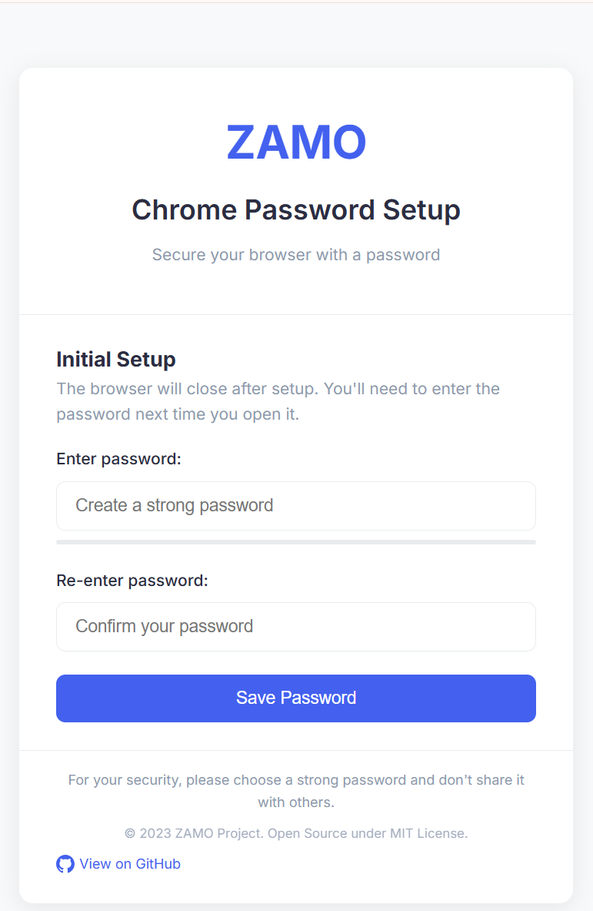
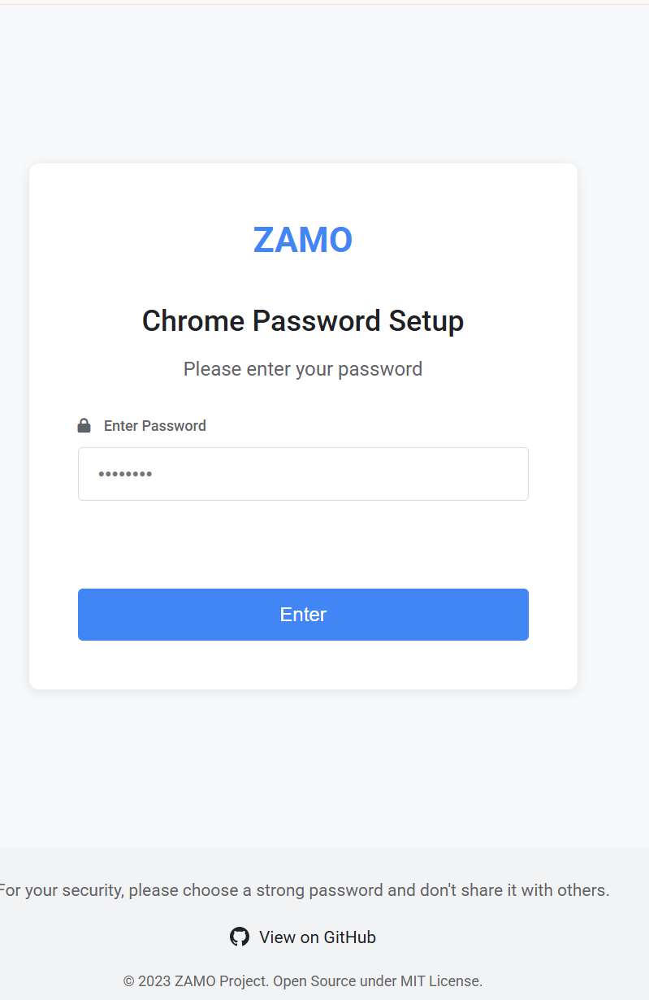

# ZAMO - Chrome Password Protector 🔒

 *(Consider adding a logo in your assets folder)*

A lightweight Chrome extension that adds an extra layer of password protection to your browser, perfect for freelancers, families, and privacy-conscious users.

## Features ✨
- 🔐 Set a master password for Chrome access
- 🛡️ Prevents unauthorized browser access
- ⚡ Lightweight and fast
- 🌐 Works on all Chrome pages
- 🔄 Easy password reset option
- 🎨 Clean modern UI

## Installation ⚙️

### Method 1: Chrome Web Store
*(Once published)*  

### Method 2: Manual Installation
1. Download or clone this repository
2. Open Chrome and navigate to `chrome://extensions`
3. Enable "Developer mode" (toggle in top right)
4. Click "Load unpacked" and select the extension folder
5. Pin the extension for easy access

## Usage 🚀

1. After installation, click the ZAMO icon in your toolbar
2. Set your master password (remember this!)
3. The password will be required when:
   - Opening a new Chrome window
   - After browser restart
   - After 30 minutes of inactivity (configurable)

## Screenshots 🖼️

  
*Password setup interface*

  
*Login prompt*

## Development 🛠️

### Project Structure
/
├── assets/ # Images and icons
├── data/ # Data storage
├── bg.js # Background script
├── enter-password.html # Password entry UI
├── enter-password.js # Password entry logic
├── manifest.json # Extension manifest
├── set-password.html # Password setup UI
└── set-password.js # Password setup logic

### Building
This extension uses vanilla JS and doesn't require compilation. Just load the folder in Chrome.

### Contributing
Pull requests are welcome! For major changes, please open an issue first.

## Security 🔒
- Passwords are hashed using SHA-256 before storage
- No external data collection
- All processing happens locally

## FAQ ❓

**Q: What happens if I forget my password?**  
A: You'll need to reinstall the extension (this is a security feature).

**Q: Does this sync across devices?**  
A: No, for security reasons the password is device-local.

**Q: How is this different from Chrome's built-in password manager?**  
A: This protects access to the entire browser, not just saved passwords.

**Q: Can I change my password after setting it?**  
A: Yes, you can change it anytime through the extension popup.

**Q: Is my password stored securely?**  
A: Yes, we only store a hashed version and never the plain text password.

## Support 💖
If you find this useful, please consider:
- ⭐ Starring this repository
- 🐛 Reporting issues
- 💻 Contributing code
- 📢 Sharing with your network

## Roadmap 🗺️
- [ ] Add biometric authentication support
- [ ] Implement auto-lock timeout customization
- [ ] Add password hint feature
- [ ] Develop browser action quick menu

## License 📄
MIT License - [View License](LICENSE)

---

For support or feature requests, please open an issue in our [GitHub repository](https://github.com/morpheusadam/Chrome-Password-Protector-ZAMO-).